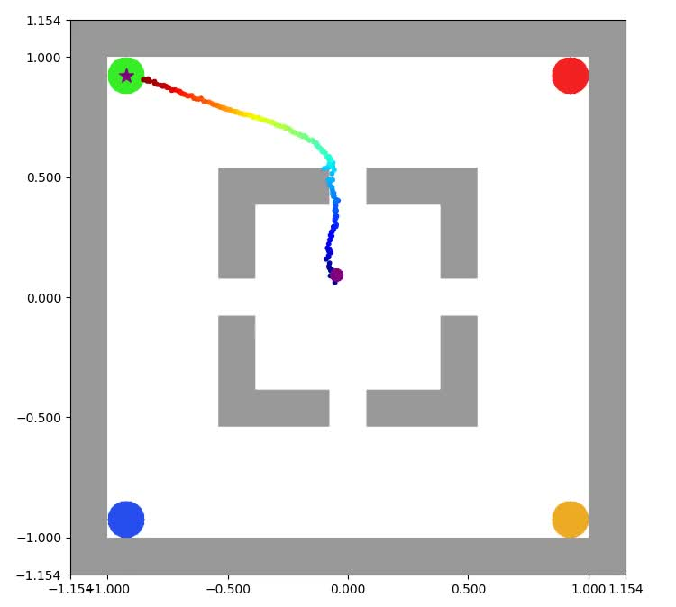
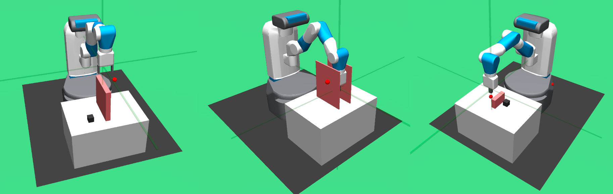

## Cold Diffusion on the Replay Buffer: Learning to Plan from Known Good States

Gymnasium Maze Environments


Gymnasium Fetch Environments


## Overview

This repository contains the camera-ready code implementation of the paper [Cold Diffusion on the Replay Buffer: Learning to Plan from Known Good States](https://openreview.net/forum?id=AyRr_i028w).

It includes the training code for the Diffuser and our CDRB approach. 

## Training data and pretrained model download

### Corner Env

Download all files from [google drive](https://drive.google.com/drive/folders/1cNq8Bn3ma-w_RmuXCNCrmE_xVIu4xfFw?usp=drive_link) and place them according to this:

```plaintext
─── corner_env
   ├── cdrb
   │   ├── all_model
   │   ├── replay_buffer_euclidean
   │   └── replay_buffer_kmeans
   ├── diffuser
   │   └── all_model
   └── expert_data
```

### Fetch Env

Download all files from [google drive](https://drive.google.com/drive/folders/1tS2i-VqO5VLRxXklP33TFace-qwWwl4I?usp=drive_link) and place them according to this:

```plaintext
─── fetch_env
   ├── cdrb
   │   ├── all_model
   │   └── replay_buffer_kmeans
   ├── diffuser
   │   └── all_model
   └── expert_data
```

## Training and testing procedures

- For Gymnasium Maze environment models, please follow the instructions [here](corner_env/README.md)

- For Gymnasium Fetch environment models, please follow the instructions [here](fetch_env/README.md)

## Citation

If you find the code or pre-trained models useful in your research, please consider citing an appropriate subset of the following papers:

```plaintext
@inproceedings{
wang2023cold,
title={Cold Diffusion on the Replay Buffer: Learning to Plan from Known Good States},
author={Zidan Wang and Takuma Yoneda and Takeru Oba and Rui Shen and Matthew Walter and Bradly C. Stadie},
booktitle={7th Annual Conference on Robot Learning},
year={2023},
url={https://openreview.net/forum?id=AyRr_i028w}
}
```